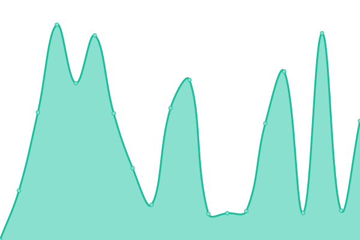
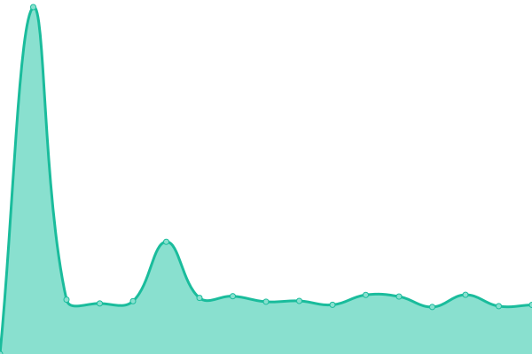
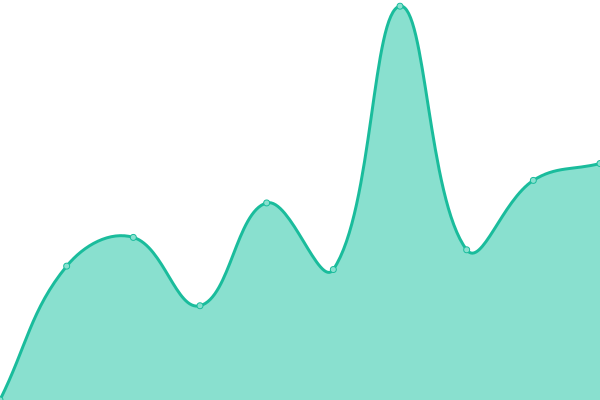
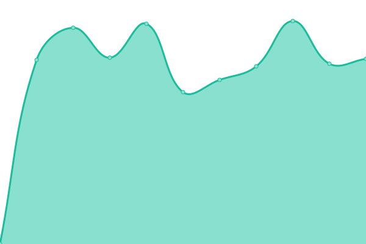
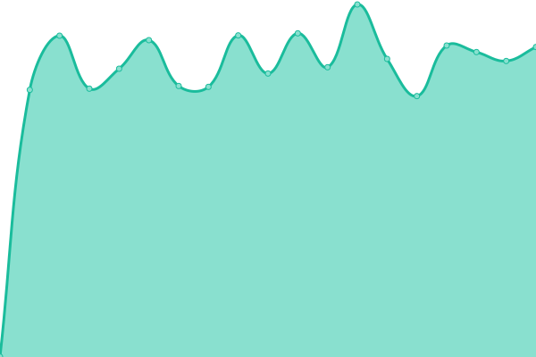
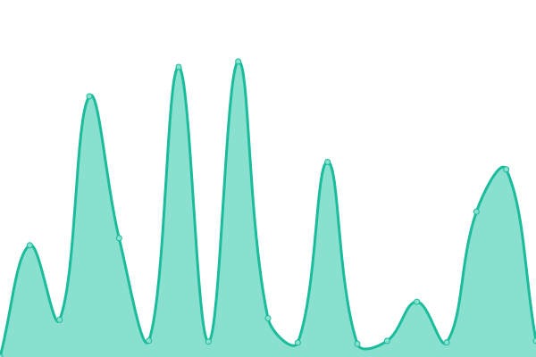
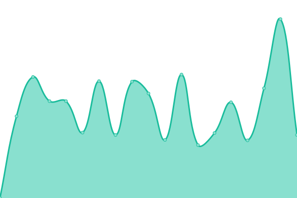
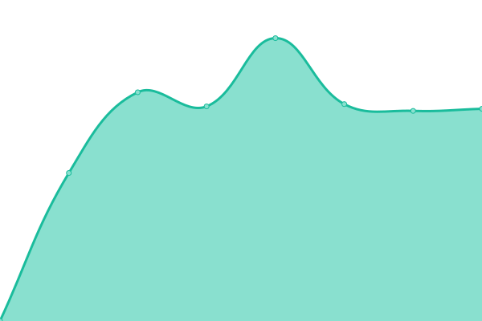

# [📈 Kalbar Networks Website](https://abimanyu.github.io/Kalbarnetworks): <!--live status--> **🟧 Partial outage**

This repository contains the open-source uptime monitor and status page for [Abimanyu Yusuf](http://abimanyu.net), powered by [Upptime](https://github.com/upptime/upptime).

With [Upptime](https://upptime.js.org), you can get your own unlimited and free uptime monitor and status page, powered entirely by a GitHub repository. We use [Issues](https://github.com/abimanyu/Kalbarnetworks/issues) as incident reports, [Actions](https://github.com/abimanyu/Kalbarnetworks/actions) as uptime monitors, and [Pages](https://abimanyu.github.io/Kalbarnetworks) for the status page.

<!--start: status pages-->
<!-- This summary is generated by Upptime (https://github.com/upptime/upptime) -->
<!-- Do not edit this manually, your changes will be overwritten -->
<!-- prettier-ignore -->
| URL | Status | History | Response Time | Uptime |
| --- | ------ | ------- | ------------- | ------ |
|  [Kalbar Prov](https://kalbarprov.go.id) | Non-aktif | [kalbar-prov.yml](https://github.com/abimanyu/Kalbarnetworks/commits/HEAD/history/kalbar-prov.yml) | 

 0ms
     
 | 

<a href="https://abimanyu.github.io/kalbarnetworks/history/kalbar-prov">0.00%</a>
    

|  [Kota Pontianak](https://pontianak.go.id) | Aktif | [kota-pontianak.yml](https://github.com/abimanyu/Kalbarnetworks/commits/HEAD/history/kota-pontianak.yml) | 

 11049ms
     
 | 

<a href="https://abimanyu.github.io/kalbarnetworks/history/kota-pontianak">100.00%</a>
    

|  [Kota Singkawang](https://singkawangkota.go.id) | Aktif | [kota-singkawang.yml](https://github.com/abimanyu/Kalbarnetworks/commits/HEAD/history/kota-singkawang.yml) | 

 1378ms
     
 | 

<a href="https://abimanyu.github.io/kalbarnetworks/history/kota-singkawang">100.00%</a>
    

|  [Kab. Mempawah](https://www.mempawahkab.go.id) | Non-aktif | [kab-mempawah.yml](https://github.com/abimanyu/Kalbarnetworks/commits/HEAD/history/kab-mempawah.yml) | 

 2877ms
     
 | 

<a href="https://abimanyu.github.io/kalbarnetworks/history/kab-mempawah">99.18%</a>
    

|  [Kab. Bengkayang](http://bengkayangkab.go.id) | Aktif | [kab-bengkayang.yml](https://github.com/abimanyu/Kalbarnetworks/commits/HEAD/history/kab-bengkayang.yml) | 

 3285ms
     
 | 

<a href="https://abimanyu.github.io/kalbarnetworks/history/kab-bengkayang">100.00%</a>
    

|  [Kab. Sanggau](https://sanggau.go.id) | Aktif | [kab-sanggau.yml](https://github.com/abimanyu/Kalbarnetworks/commits/HEAD/history/kab-sanggau.yml) | 

 3250ms
     
 | 

<a href="https://abimanyu.github.io/kalbarnetworks/history/kab-sanggau">100.00%</a>
    

|  [Kab. Sintang](http://sintang.go.id) | Aktif | [kab-sintang.yml](https://github.com/abimanyu/Kalbarnetworks/commits/HEAD/history/kab-sintang.yml) | 

 2274ms
     
 | 

<a href="https://abimanyu.github.io/kalbarnetworks/history/kab-sintang">74.20%</a>
    

|  [Kab. Landak](http://landakkab.go.id) | Aktif | [kab-landak.yml](https://github.com/abimanyu/Kalbarnetworks/commits/HEAD/history/kab-landak.yml) | 

 9911ms
     
 | 

<a href="https://abimanyu.github.io/kalbarnetworks/history/kab-landak">100.00%</a>
    

|  [Kab. Ketapang](https://ketapangkab.go.id) | Aktif | [kab-ketapang.yml](https://github.com/abimanyu/Kalbarnetworks/commits/HEAD/history/kab-ketapang.yml) | 

 1551ms
     
 | 

<a href="https://abimanyu.github.io/kalbarnetworks/history/kab-ketapang">99.83%</a>
    

|  [Kab. Sekadau](https://sekadaukab.go.id) | Aktif | [kab-sekadau.yml](https://github.com/abimanyu/Kalbarnetworks/commits/HEAD/history/kab-sekadau.yml) | 

 1971ms
     
 | 

<a href="https://abimanyu.github.io/kalbarnetworks/history/kab-sekadau">100.00%</a>
    

|  [Kab. Sambas](https://sambas.go.id) | Aktif | [kab-sambas.yml](https://github.com/abimanyu/Kalbarnetworks/commits/HEAD/history/kab-sambas.yml) | 

 2759ms
     
 | 

<a href="https://abimanyu.github.io/kalbarnetworks/history/kab-sambas">98.16%</a>
    

|  [Kab. Melawi](http://melawikab.go.id) | Aktif | [kab-melawi.yml](https://github.com/abimanyu/Kalbarnetworks/commits/HEAD/history/kab-melawi.yml) | 

 6630ms
     
 | 

<a href="https://abimanyu.github.io/kalbarnetworks/history/kab-melawi">53.63%</a>
    

|  [Kab. Kubu Raya](https://kuburayakab.go.id) | Aktif | [kab-kubu-raya.yml](https://github.com/abimanyu/Kalbarnetworks/commits/HEAD/history/kab-kubu-raya.yml) | 

 5247ms
     
 | 

<a href="https://abimanyu.github.io/kalbarnetworks/history/kab-kubu-raya">98.95%</a>
    

|  [Kab. Kayong Utara](https://kayongutarakab.go.id) | Aktif | [kab-kayong-utara.yml](https://github.com/abimanyu/Kalbarnetworks/commits/HEAD/history/kab-kayong-utara.yml) | 

 4910ms
     
 | 

<a href="https://abimanyu.github.io/kalbarnetworks/history/kab-kayong-utara">96.44%</a>
    

|  [Kab. Kapuas Hulu](https://www.kapuashulukab.go.id) | Aktif | [kab-kapuas-hulu.yml](https://github.com/abimanyu/Kalbarnetworks/commits/HEAD/history/kab-kapuas-hulu.yml) | 

 2175ms
     
 | 

<a href="https://abimanyu.github.io/kalbarnetworks/history/kab-kapuas-hulu">100.00%</a>
    

|  [Badan Penghubung](https://penghubung.kalbarprov.go.id) | Aktif | [badan-penghubung.yml](https://github.com/abimanyu/Kalbarnetworks/commits/HEAD/history/badan-penghubung.yml) | 

 2776ms
     
 | 

<a href="https://abimanyu.github.io/kalbarnetworks/history/badan-penghubung">96.96%</a>
    

|  [BALITBANG](https://litbang.kalbarprov.go.id) | Aktif | [balitbang.yml](https://github.com/abimanyu/Kalbarnetworks/commits/HEAD/history/balitbang.yml) | 

 2228ms
     
 | 

<a href="https://abimanyu.github.io/kalbarnetworks/history/balitbang">0.00%</a>
    

|  [BAPENDA](https://bapenda.kalbarprov.go.id) | Aktif | [bapenda.yml](https://github.com/abimanyu/Kalbarnetworks/commits/HEAD/history/bapenda.yml) | 

 1799ms
     
 | 

<a href="https://abimanyu.github.io/kalbarnetworks/history/bapenda">97.02%</a>
    

|  [BAPPEDA](https://bappeda.kalbarprov.go.id) | Aktif | [bappeda.yml](https://github.com/abimanyu/Kalbarnetworks/commits/HEAD/history/bappeda.yml) | 

 1977ms
     
 | 

<a href="https://abimanyu.github.io/kalbarnetworks/history/bappeda">100.00%</a>
    

|  [Biro Administrasi Pembangunan](https://adpim.kalbarprov.go.id) | Aktif | [biro-administrasi-pembangunan.yml](https://github.com/abimanyu/Kalbarnetworks/commits/HEAD/history/biro-administrasi-pembangunan.yml) | 

 1440ms
     
 | 

<a href="https://abimanyu.github.io/kalbarnetworks/history/biro-administrasi-pembangunan">97.03%</a>
    

|  [Biro Hukum](https://jdih.kalbarprov.go.id) | Aktif | [biro-hukum.yml](https://github.com/abimanyu/Kalbarnetworks/commits/HEAD/history/biro-hukum.yml) | 

 3738ms
     
 | 

<a href="https://abimanyu.github.io/kalbarnetworks/history/biro-hukum">72.35%</a>
    

|  [Biro Kesejahteraan Rakyat](https://birokesra.kalbarprov.go.id) | Aktif | [biro-kesejahteraan-rakyat.yml](https://github.com/abimanyu/Kalbarnetworks/commits/HEAD/history/biro-kesejahteraan-rakyat.yml) | 

 2193ms
     
 | 

<a href="https://abimanyu.github.io/kalbarnetworks/history/biro-kesejahteraan-rakyat">97.04%</a>
    

|  [Biro Organisasi](https://biroorganisasi.kalbarprov.go.id) | Aktif | [biro-organisasi.yml](https://github.com/abimanyu/Kalbarnetworks/commits/HEAD/history/biro-organisasi.yml) | 

 4767ms
     
 | 

<a href="https://abimanyu.github.io/kalbarnetworks/history/biro-organisasi">97.14%</a>
    

|  [Biro Organisasi](https://biroorganisasi.kalbarprov.go.id) | Aktif | [biro-organisasi.yml](https://github.com/abimanyu/Kalbarnetworks/commits/HEAD/history/biro-organisasi.yml) | 

 4767ms
     
 | 

<a href="https://abimanyu.github.io/kalbarnetworks/history/biro-organisasi">97.14%</a>
    

|  [Biro Pemerintahan](https://biropemerintahan.kalbarprov.go.id) | Aktif | [biro-pemerintahan.yml](https://github.com/abimanyu/Kalbarnetworks/commits/HEAD/history/biro-pemerintahan.yml) | 

 1647ms
     
 | 

<a href="https://abimanyu.github.io/kalbarnetworks/history/biro-pemerintahan">28.76%</a>
    

|  [Biro Pengadaan Barang Dan Jasa](https://pbj.kalbarprov.go.id) | Aktif | [biro-pengadaan-barang-dan-jasa.yml](https://github.com/abimanyu/Kalbarnetworks/commits/HEAD/history/biro-pengadaan-barang-dan-jasa.yml) | 

 6165ms
     
 | 

<a href="https://abimanyu.github.io/kalbarnetworks/history/biro-pengadaan-barang-dan-jasa">100.00%</a>
    

|  [Biro Perekonomian](https://biroekonomi.kalbarprov.go.id) | Aktif | [biro-perekonomian.yml](https://github.com/abimanyu/Kalbarnetworks/commits/HEAD/history/biro-perekonomian.yml) | 

 1390ms
     
 | 

<a href="https://abimanyu.github.io/kalbarnetworks/history/biro-perekonomian">28.77%</a>
    

|  [Biro Umum](https://biroumum.kalbarprov.go.id) | Aktif | [biro-umum.yml](https://github.com/abimanyu/Kalbarnetworks/commits/HEAD/history/biro-umum.yml) | 

 4900ms
     
 | 

<a href="https://abimanyu.github.io/kalbarnetworks/history/biro-umum">99.42%</a>
    

|  [BKAD](https://bkad.kalbarprov.go.id) | Aktif | [bkad.yml](https://github.com/abimanyu/Kalbarnetworks/commits/HEAD/history/bkad.yml) | 

 6711ms
     
 | 

<a href="https://abimanyu.github.io/kalbarnetworks/history/bkad">36.03%</a>
    

|  [BKD](https://bkd.kalbarprov.go.id) | Aktif | [bkd.yml](https://github.com/abimanyu/Kalbarnetworks/commits/HEAD/history/bkd.yml) | 

 1745ms
     
 | 

<a href="https://abimanyu.github.io/kalbarnetworks/history/bkd">100.00%</a>
    

|  [BPBD](https://bpbd.kalbarprov.go.id) | Aktif | [bpbd.yml](https://github.com/abimanyu/Kalbarnetworks/commits/HEAD/history/bpbd.yml) | 

 982ms
     
 | 

<a href="https://abimanyu.github.io/kalbarnetworks/history/bpbd">11.44%</a>
    

|  [BPSDM](https://bpsdm.kalbarprov.go.id) | Aktif | [bpsdm.yml](https://github.com/abimanyu/Kalbarnetworks/commits/HEAD/history/bpsdm.yml) | 

 2058ms
     
 | 

<a href="https://abimanyu.github.io/kalbarnetworks/history/bpsdm">99.43%</a>
    

|  [DIKBUD](https://dikbud.kalbarprov.go.id) | Aktif | [dikbud.yml](https://github.com/abimanyu/Kalbarnetworks/commits/HEAD/history/dikbud.yml) | 

 2155ms
     
 | 

<a href="https://abimanyu.github.io/kalbarnetworks/history/dikbud">99.43%</a>
    

|  [Dinas PUPR](https://dpu.kalbarprov.go.id) | Aktif | [dinas-pupr.yml](https://github.com/abimanyu/Kalbarnetworks/commits/HEAD/history/dinas-pupr.yml) | 

 3209ms
     
 | 

<a href="https://abimanyu.github.io/kalbarnetworks/history/dinas-pupr">99.45%</a>
    

|  [DINKES](https://dinkes.kalbarprov.go.id) | Aktif | [dinkes.yml](https://github.com/abimanyu/Kalbarnetworks/commits/HEAD/history/dinkes.yml) | 

 980ms
     
 | 

<a href="https://abimanyu.github.io/kalbarnetworks/history/dinkes">11.44%</a>
    

|  [DINSOS](https://dinsos.kalbarprov.go.id) | Aktif | [dinsos.yml](https://github.com/abimanyu/Kalbarnetworks/commits/HEAD/history/dinsos.yml) | 

 3149ms
     
 | 

<a href="https://abimanyu.github.io/kalbarnetworks/history/dinsos">100.00%</a>
    

|  [DISBUNAK](https://disbun.kalbarprov.go.id) | Non-aktif | [disbunak.yml](https://github.com/abimanyu/Kalbarnetworks/commits/HEAD/history/disbunak.yml) | 

 0ms
     
 | 

<a href="https://abimanyu.github.io/kalbarnetworks/history/disbunak">0.00%</a>
    

|  [DISDUKCAPIL](https://dukcapil.kalbarprov.go.id) | Aktif | [disdukcapil.yml](https://github.com/abimanyu/Kalbarnetworks/commits/HEAD/history/disdukcapil.yml) | 

 2067ms
     
 | 

<a href="https://abimanyu.github.io/kalbarnetworks/history/disdukcapil">99.45%</a>
    

|  [DISHANPAN](https://disketpangan.kalbarprov.go.id) | Aktif | [dishanpan.yml](https://github.com/abimanyu/Kalbarnetworks/commits/HEAD/history/dishanpan.yml) | 

 976ms
     
 | 

<a href="https://abimanyu.github.io/kalbarnetworks/history/dishanpan">13.27%</a>
    

|  [DISHUB](https://dishub.kalbarprov.go.id) | Aktif | [dishub.yml](https://github.com/abimanyu/Kalbarnetworks/commits/HEAD/history/dishub.yml) | 

 1353ms
     
 | 

<a href="https://abimanyu.github.io/kalbarnetworks/history/dishub">99.46%</a>
    

|  [DISKOMINFO](https://diskominfo.kalbarprov.go.id) | Aktif | [diskominfo.yml](https://github.com/abimanyu/Kalbarnetworks/commits/HEAD/history/diskominfo.yml) | 

 942ms
     
 | 

<a href="https://abimanyu.github.io/kalbarnetworks/history/diskominfo">74.63%</a>
    

|  [DISKOPUKM](https://diskopukm.kalbarprov.go.id) | Aktif | [diskopukm.yml](https://github.com/abimanyu/Kalbarnetworks/commits/HEAD/history/diskopukm.yml) | 

 983ms
     
 | 

<a href="https://abimanyu.github.io/kalbarnetworks/history/diskopukm">88.40%</a>
    

|  [DISLAUTKAN](https://dislautkan.kalbarprov.go.id) | Aktif | [dislautkan.yml](https://github.com/abimanyu/Kalbarnetworks/commits/HEAD/history/dislautkan.yml) | 

 2957ms
     
 | 

<a href="https://abimanyu.github.io/kalbarnetworks/history/dislautkan">99.46%</a>
    

|  [DISNAKERTRANS](https://disnakertrans.kalbarprov.go.id) | Aktif | [disnakertrans.yml](https://github.com/abimanyu/Kalbarnetworks/commits/HEAD/history/disnakertrans.yml) | 

 3410ms
     
 | 

<a href="https://abimanyu.github.io/kalbarnetworks/history/disnakertrans">99.46%</a>
    

|  [DISNAKESWAN](https://dppkh.kalbarprov.go.id) | Non-aktif | [disnakeswan.yml](https://github.com/abimanyu/Kalbarnetworks/commits/HEAD/history/disnakeswan.yml) | 

 0ms
     
 | 

<a href="https://abimanyu.github.io/kalbarnetworks/history/disnakeswan">0.00%</a>
    

|  [DISPERINDAGESDM](https://disperindag.kalbarprov.go.id) | Non-aktif | [disperindagesdm.yml](https://github.com/abimanyu/Kalbarnetworks/commits/HEAD/history/disperindagesdm.yml) | 

 0ms
     
 | 

<a href="https://abimanyu.github.io/kalbarnetworks/history/disperindagesdm">0.00%</a>
    

|  [DISPORAPAR](https://disporapar.kalbarprov.go.id) | Aktif | [disporapar.yml](https://github.com/abimanyu/Kalbarnetworks/commits/HEAD/history/disporapar.yml) | 

 9079ms
     
 | 

<a href="https://abimanyu.github.io/kalbarnetworks/history/disporapar">99.47%</a>
    

|  [DLHK](https://lhk.kalbarprov.go.id) | Aktif | [dlhk.yml](https://github.com/abimanyu/Kalbarnetworks/commits/HEAD/history/dlhk.yml) | 

 3518ms
     
 | 

<a href="https://abimanyu.github.io/kalbarnetworks/history/dlhk">99.47%</a>
    

|  [DP3A](https://dp3a.kalbarprov.go.id) | Aktif | [dp-3-a.yml](https://github.com/abimanyu/Kalbarnetworks/commits/HEAD/history/dp-3-a.yml) | 

 2072ms
     
 | 

<a href="https://abimanyu.github.io/kalbarnetworks/history/dp-3-a">99.48%</a>
    

|  [DPK](https://dpk.kalbarprov.go.id) | Aktif | [dpk.yml](https://github.com/abimanyu/Kalbarnetworks/commits/HEAD/history/dpk.yml) | 

 2839ms
     
 | 

<a href="https://abimanyu.github.io/kalbarnetworks/history/dpk">99.48%</a>
    

|  [DPM-PTSP](https://dpm-ptsp.kalbarprov.go.id) | Aktif | [dpm-ptsp.yml](https://github.com/abimanyu/Kalbarnetworks/commits/HEAD/history/dpm-ptsp.yml) | 

 2092ms
     
 | 

<a href="https://abimanyu.github.io/kalbarnetworks/history/dpm-ptsp">99.48%</a>
    

|  [DPMD](https://dpmd.kalbarprov.go.id) | Aktif | [dpmd.yml](https://github.com/abimanyu/Kalbarnetworks/commits/HEAD/history/dpmd.yml) | 

 6583ms
     
 | 

<a href="https://abimanyu.github.io/kalbarnetworks/history/dpmd">99.49%</a>
    

|  [DPRD](https://dprd.kalbarprov.go.id) | Aktif | [dprd.yml](https://github.com/abimanyu/Kalbarnetworks/commits/HEAD/history/dprd.yml) | 

 977ms
     
 | 

<a href="https://abimanyu.github.io/kalbarnetworks/history/dprd">100.00%</a>
    

|  [DTPH](https://distan.kalbarprov.go.id) | Aktif | [dtph.yml](https://github.com/abimanyu/Kalbarnetworks/commits/HEAD/history/dtph.yml) | 

 2908ms
     
 | 

<a href="https://abimanyu.github.io/kalbarnetworks/history/dtph">99.52%</a>
    

|  [INSPEKTORAT](https://inspektorat.kalbarprov.go.id) | Aktif | [inspektorat.yml](https://github.com/abimanyu/Kalbarnetworks/commits/HEAD/history/inspektorat.yml) | 

 2273ms
     
 | 

<a href="https://abimanyu.github.io/kalbarnetworks/history/inspektorat">99.52%</a>
    

|  [KESBANGPOL](https://kesbangpol.kalbarprov.go.id) | Aktif | [kesbangpol.yml](https://github.com/abimanyu/Kalbarnetworks/commits/HEAD/history/kesbangpol.yml) | 

 2196ms
     
 | 

<a href="https://abimanyu.github.io/kalbarnetworks/history/kesbangpol">99.53%</a>
    

|  [PERKIM](https://perkim.kalbarprov.go.id) | Aktif | [perkim.yml](https://github.com/abimanyu/Kalbarnetworks/commits/HEAD/history/perkim.yml) | 

 5577ms
     
 | 

<a href="https://abimanyu.github.io/kalbarnetworks/history/perkim">99.48%</a>
    

|  [RSJ Sui Bangkong](https://rsjdsuibangkong.kalbarprov.go.id) | Aktif | [rsj-sui-bangkong.yml](https://github.com/abimanyu/Kalbarnetworks/commits/HEAD/history/rsj-sui-bangkong.yml) | 

 1058ms
     
 | 

<a href="https://abimanyu.github.io/kalbarnetworks/history/rsj-sui-bangkong">99.51%</a>
    

|  [RSUD dr. Soedarso](https://rsuddrsoedarso.kalbarprov.go.id) | Aktif | [rsud-dr-soedarso.yml](https://github.com/abimanyu/Kalbarnetworks/commits/HEAD/history/rsud-dr-soedarso.yml) | 

 2147ms
     
 | 

<a href="https://abimanyu.github.io/kalbarnetworks/history/rsud-dr-soedarso">99.53%</a>
    

|  [Rumah Sakit Jiwa Provinsi](https://rsjprov.kalbarprov.go.id) | Aktif | [rumah-sakit-jiwa-provinsi.yml](https://github.com/abimanyu/Kalbarnetworks/commits/HEAD/history/rumah-sakit-jiwa-provinsi.yml) | 

 948ms
     
 | 

<a href="https://abimanyu.github.io/kalbarnetworks/history/rumah-sakit-jiwa-provinsi">100.00%</a>
    

|  [SATPOL PP](https://satpolpp.kalbarprov.go.id) | Aktif | [satpol-pp.yml](https://github.com/abimanyu/Kalbarnetworks/commits/HEAD/history/satpol-pp.yml) | 

 2227ms
     
 | 

<a href="https://abimanyu.github.io/kalbarnetworks/history/satpol-pp">99.54%</a>
    

|  [UPT-TIKP Kalbar](https://upttikp.kalbarprov.go.id) | Non-aktif | [upt-tikp-kalbar.yml](https://github.com/abimanyu/Kalbarnetworks/commits/HEAD/history/upt-tikp-kalbar.yml) | 

 0ms
     
 | 

<a href="https://abimanyu.github.io/kalbarnetworks/history/upt-tikp-kalbar">0.00%</a>
    

|  [Mail Kalbarprov](https://mail.kalbarprov.go.id) | Aktif | [mail-kalbarprov.yml](https://github.com/abimanyu/Kalbarnetworks/commits/HEAD/history/mail-kalbarprov.yml) | 

 1371ms
     
 | 

<a href="https://abimanyu.github.io/kalbarnetworks/history/mail-kalbarprov">100.00%</a>
    

|  [Datacloud Kalbarprov](https://datacloud.kalbarprov.go.id) | Aktif | [datacloud-kalbarprov.yml](https://github.com/abimanyu/Kalbarnetworks/commits/HEAD/history/datacloud-kalbarprov.yml) | 

 1039ms
     
 | 

<a href="https://abimanyu.github.io/kalbarnetworks/history/datacloud-kalbarprov">100.00%</a>
    

|  [edoc Kalbarprov](https://edoc.kalbarprov.go.id) | Non-aktif | [edoc-kalbarprov.yml](https://github.com/abimanyu/Kalbarnetworks/commits/HEAD/history/edoc-kalbarprov.yml) | 

 0ms
     
 | 

<a href="https://abimanyu.github.io/kalbarnetworks/history/edoc-kalbarprov">0.00%</a>
    

|  [SIBOWAL](https://vidcon.kalbarprov.go.id) | Aktif | [sibowal.yml](https://github.com/abimanyu/Kalbarnetworks/commits/HEAD/history/sibowal.yml) | 

 1163ms
     
 | 

<a href="https://abimanyu.github.io/kalbarnetworks/history/sibowal">99.54%</a>
    

|  [E-Activity](https://aktivitas.kalbarprov.go.id) | Aktif | [e-activity.yml](https://github.com/abimanyu/Kalbarnetworks/commits/HEAD/history/e-activity.yml) | 

 1659ms
     
 | 

<a href="https://abimanyu.github.io/kalbarnetworks/history/e-activity">100.00%</a>
    

|  [PresensiPemprov](https://presensi.kalbarprov.go.id) | Aktif | [presensi-pemprov.yml](https://github.com/abimanyu/Kalbarnetworks/commits/HEAD/history/presensi-pemprov.yml) | 

 1049ms
     
 | 

<a href="https://abimanyu.github.io/kalbarnetworks/history/presensi-pemprov">100.00%</a>
    

|  [Kapuas](https://kapuas.kalbarprov.go.id) | Aktif | [kapuas.yml](https://github.com/abimanyu/Kalbarnetworks/commits/HEAD/history/kapuas.yml) | 

 1069ms
     
 | 

<a href="https://abimanyu.github.io/kalbarnetworks/history/kapuas">99.55%</a>
    

|  [Layanan](https://layanan.kalbarprov.go.id) | Aktif | [layanan.yml](https://github.com/abimanyu/Kalbarnetworks/commits/HEAD/history/layanan.yml) | 

 1054ms
     
 | 

<a href="https://abimanyu.github.io/kalbarnetworks/history/layanan">99.55%</a>
    

|  [FLLAJ](https://www.fllaj.kalbarprov.go.id) | Aktif | [fllaj.yml](https://github.com/abimanyu/Kalbarnetworks/commits/HEAD/history/fllaj.yml) | 

 2318ms
     
 | 

<a href="https://abimanyu.github.io/kalbarnetworks/history/fllaj">100.00%</a>
    

|  [E-KINERJA](https://ekinerja.kalbarprov.go.id) | Non-aktif | [e-kinerja.yml](https://github.com/abimanyu/Kalbarnetworks/commits/HEAD/history/e-kinerja.yml) | 

 0ms
     
 | 

<a href="https://abimanyu.github.io/kalbarnetworks/history/e-kinerja">0.00%</a>
    

<!--end: status pages-->

[**Visit our status website →**](https://abimanyu.github.io/Kalbarnetworks)

## 📄 License

- Powered by: [Upptime](https://github.com/upptime/upptime)
- Code: [MIT](./LICENSE) © [Abimanyu Yusuf](http://abimanyu.net)
- Data in the `./history` directory: [Open Database License](https://opendatacommons.org/licenses/odbl/1-0/)
